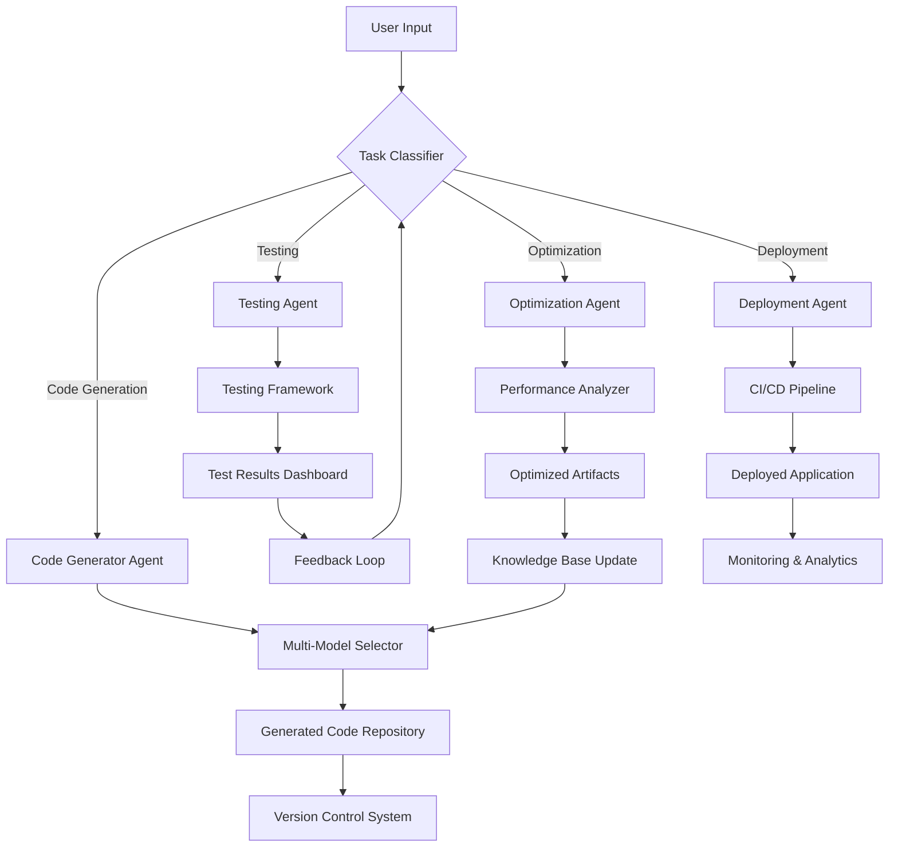

Artificial Intelligence Operating System

### Introduction to AIOS

An **AIOS (Artificial Intelligence Operating System)** is a conceptual operating system designed to facilitate the development, deployment, and management of applications entirely driven by artificial intelligence (AI) agents. These agents leverage the power of various large language models (LLMs), machine learning frameworks, and other AI technologies to automate tasks, generate code, optimize workflows, and provide intelligent decision-making capabilities.

The goal of an AIOS is to abstract away much of the complexity involved in software development, allowing developers to focus on high-level design while delegating low-level implementation details to AI agents. This could revolutionize how software is built, tested, and deployed, making it more accessible to non-experts and accelerating innovation.

---

<!--more-->{: id="more"}

### Key Components of an AIOS

1. **AI Agent Framework**:
   - A modular architecture where each AI agent specializes in specific tasks such as code generation, debugging, testing, or optimization.
   - Agents communicate with each other through well-defined APIs and protocols.

2. **Multi-Model Integration**:
   - Support for multiple LLMs (e.g., GPT, PaLM, Llama) and domain-specific models (e.g., vision models, speech-to-text models).
   - Dynamic selection of the best model for a given task based on context and requirements.

3. **Task Orchestration Layer**:
   - Coordinates the activities of AI agents, ensuring seamless collaboration and efficient resource utilization.
   - Handles scheduling, prioritization, and conflict resolution among agents.

4. **Development Environment**:
   - An intuitive interface for users to interact with the AIOS, including natural language commands, visual tools, and dashboards.
   - Real-time feedback and suggestions from AI agents during the development process.

5. **Version Control & Deployment Pipeline**:
   - Automated version control for generated artifacts (code, configurations, etc.).
   - Continuous integration/continuous deployment (CI/CD) pipelines managed by AI agents.

6. **Security & Governance**:
   - Built-in mechanisms to ensure compliance with ethical guidelines, data privacy regulations, and security standards.
   - Monitoring and auditing of AI agent actions to prevent misuse.

7. **Knowledge Base**:
   - A centralized repository of reusable components, templates, and learned patterns that AI agents can draw upon to accelerate development.

---

### Flowchart Using Mermaid

Below is a flowchart representing the workflow of an AIOS:

---

### Detailed Explanation of the Workflow

1. **User Input**:
   - The user provides input via a natural language interface or graphical tools. For example, "Build a web app that displays stock prices."

2. **Task Classifier**:
   - The AIOS analyzes the input to determine the type of task required (e.g., code generation, testing, optimization).

3. **Code Generator Agent**:
   - If the task involves writing code, the Code Generator Agent takes over. It selects appropriate LLMs (via the Multi-Model Selector) to generate code snippets or entire modules.

4. **Multi-Model Selector**:
   - This component dynamically chooses the most suitable LLM or specialized model for the task at hand, considering factors like accuracy, speed, and cost.

5. **Testing Agent**:
   - Once the code is generated, the Testing Agent runs automated tests using predefined test cases or generates new ones based on the application's requirements.

6. **Optimization Agent**:
   - After testing, the Optimization Agent refines the code for performance, scalability, and maintainability. It may use reinforcement learning or other techniques to iteratively improve the solution.

7. **Deployment Agent**:
   - When the application passes all tests and optimizations, the Deployment Agent handles packaging, configuration, and deployment to production environments via a CI/CD pipeline.

8. **Generated Code Repository**:
   - All generated code is stored in a version-controlled repository for future reference and reuse.

9. **Test Results Dashboard**:
   - Users can view detailed reports on test outcomes, including pass/fail statuses, coverage metrics, and performance benchmarks.

10. **Performance Analyzer**:
    - Analyzes the efficiency of the deployed application and suggests further improvements if necessary.

11. **Knowledge Base Update**:
    - Successful solutions and patterns are added to the Knowledge Base, enabling AI agents to learn and improve over time.

12. **Monitoring & Analytics**:
    - Post-deployment, the AIOS continuously monitors the application's behavior, collecting telemetry data to detect anomalies and optimize performance.

13. **Feedback Loop**:
    - Insights from monitoring and user feedback are fed back into the system, refining the AI agents' decision-making processes.

---

### Steps to Build an AIOS

1. **Define Scope and Requirements**:
   - Identify the target audience, use cases, and key features of your AIOS.

2. **Design the Architecture**:
   - Create a modular architecture with clear boundaries between components like AI agents, task orchestrators, and knowledge bases.

3. **Integrate LLMs and Tools**:
   - Use APIs to connect popular LLMs (e.g., OpenAI, Hugging Face) and other AI tools. Implement a multi-model selector to choose the best tool for each task.

4. **Develop AI Agents**:
   - Train or fine-tune AI agents for specific roles such as code generation, testing, and optimization. Ensure they can collaborate effectively.

5. **Implement Task Orchestration**:
   - Develop a central orchestrator to manage agent interactions, prioritize tasks, and resolve conflicts.

6. **Create a User Interface**:
   - Build an intuitive UI/UX for users to interact with the AIOS, supporting both technical and non-technical users.

7. **Set Up Version Control and CI/CD Pipelines**:
   - Automate versioning, testing, and deployment processes to streamline app delivery.

8. **Incorporate Security and Governance**:
   - Add safeguards to protect sensitive data and ensure compliance with relevant laws and regulations.

9. **Train and Iterate**:
   - Continuously train the AI agents using real-world data and user feedback to enhance their capabilities.

10. **Launch and Scale**:
    - Deploy the AIOS to a small group of users initially, gather feedback, and scale up gradually.

---

### Challenges and Considerations

- **Interoperability**: Ensuring smooth communication between diverse AI models and tools.
- **Ethics and Bias**: Mitigating biases in AI-generated outputs and adhering to ethical principles.
- **Scalability**: Handling increasing workloads as more users adopt the platform.
- **Cost Management**: Balancing the computational costs of running multiple LLMs and AI agents.

By addressing these challenges and following the outlined steps, we can create a robust AIOS that empowers developers to build sophisticated applications with minimal manual effort.