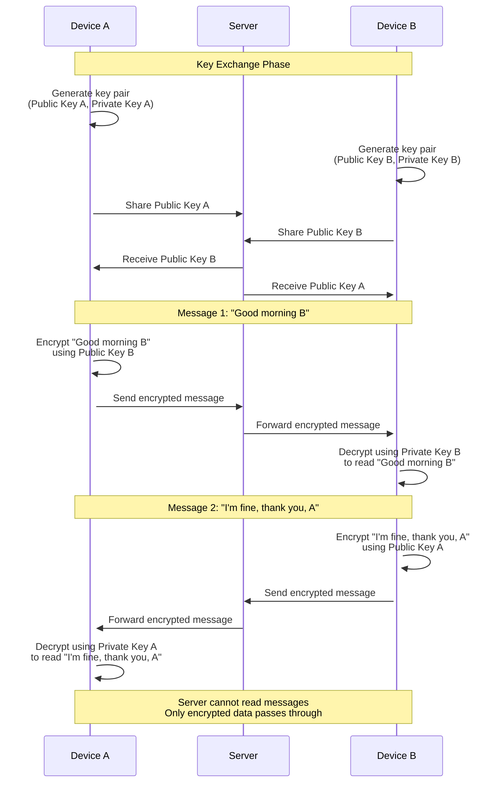

<div class="cap"></div>
 

End-To-End Encryption

> Can you elaborate more on the end-to-end encryption of messages? For example: when device-A sends "Good morning device-B" to device-B, how's that message encrypted, where does the encryption keys stored? Are there private and public keys? Then how does device-B decrypt that?


End-to-end encryption (E2EE) ensures that only the sender and intended recipient can read the messages, even if the data is intercepted during transmission or stored on servers. Below is a detailed explanation of how E2EE works in the context of your example, where **Device-A** sends the message "Good morning Device-B" to **Device-B**.

---

## **1. Key Concepts of End-to-End Encryption**
To understand how E2EE works, let's first review some key cryptographic concepts:
- **Symmetric Encryption**: Uses a single shared secret key for both encryption and decryption.
- **Asymmetric Encryption**: Uses a pair of keys: a **public key** (shared with others) and a **private key** (kept secret by the owner). The public key encrypts data, and the private key decrypts it.
- **Diffie-Hellman Key Exchange**: A protocol for securely exchanging symmetric keys over an insecure channel.

In E2EE systems like WhatsApp, **asymmetric encryption** is typically used to establish a secure channel and exchange symmetric keys, while **symmetric encryption** is used for encrypting the actual messages due to its efficiency.

---

## **2. Workflow for Encrypting and Decrypting Messages**



### **Step 1: Key Generation**
Each device generates its own **key pair** (public and private keys):
- **Device-A** generates:
  - Public Key: `PublicKey_A`
  - Private Key: `PrivateKey_A` (stored securely on the device)
- **Device-B** generates:
  - Public Key: `PublicKey_B`
  - Private Key: `PrivateKey_B` (stored securely on the device)

The public keys are shared with the server or exchanged directly between devices, while the private keys remain securely stored on their respective devices.

---

### **Step 2: Key Exchange**
When **Device-A** wants to send a message to **Device-B**, they need to agree on a **shared symmetric key** for encrypting the message. This is done using a **Diffie-Hellman Key Exchange** or similar protocols:
1. **Device-A** retrieves **Device-B's public key** (`PublicKey_B`) from the server.
2. **Device-A** uses its own private key (`PrivateKey_A`) and **Device-B's public key** (`PublicKey_B`) to compute a shared secret key (`SharedKey_AB`).
3. Similarly, **Device-B** uses its private key (`PrivateKey_B`) and **Device-A's public key** (`PublicKey_A`) to compute the same shared secret key (`SharedKey_AB`).

This shared secret key (`SharedKey_AB`) will be used for symmetric encryption of messages between the two devices.

---

### **Step 3: Message Encryption**
Once the shared symmetric key (`SharedKey_AB`) is established, **Device-A** encrypts the message before sending it:
1. **Message**: "Good morning Device-B"
2. **Encryption**: **Device-A** uses the shared symmetric key (`SharedKey_AB`) to encrypt the message using a symmetric encryption algorithm like **AES (Advanced Encryption Standard)**.
   - Encrypted Message: `EncryptedMessage = AES.encrypt("Good morning Device-B", SharedKey_AB)`

The encrypted message is then sent to **Device-B** via the server or directly through a P2P connection.

---

### **Step 4: Message Decryption**
When **Device-B** receives the encrypted message, it decrypts it using the same shared symmetric key (`SharedKey_AB`):
1. **Decryption**: **Device-B** uses the shared symmetric key (`SharedKey_AB`) to decrypt the message:
   - Decrypted Message: `DecryptedMessage = AES.decrypt(EncryptedMessage, SharedKey_AB)`
2. **Result**: "Good morning Device-B"

Since both devices derived the same shared secret key (`SharedKey_AB`) during the key exchange, **Device-B** can successfully decrypt the message.

---

## **3. Where Are the Keys Stored?**
- **Private Keys**: Each device stores its private key securely on the device. On iOS, you can use the **Keychain** to store sensitive information like private keys. The Keychain is a secure storage mechanism provided by Apple that protects data even if the device is compromised.
- **Public Keys**: Public keys are not sensitive and can be shared freely. They are typically stored on the server or exchanged directly between devices during the initial setup.

---

## **4. Example Code for Encryption and Decryption**

### **Key Generation**
```swift
import CryptoKit

// Generate a key pair for each device
let privateKeyA = Curve25519.KeyAgreement.PrivateKey()
let publicKeyA = privateKeyA.publicKey

let privateKeyB = Curve25519.KeyAgreement.PrivateKey()
let publicKeyB = privateKeyB.publicKey
```

### **Shared Secret Key (Diffie-Hellman Key Exchange)**
```swift
// Device-A computes the shared secret key
let sharedSecretAB = try! privateKeyA.sharedSecretFromKeyAgreement(with: publicKeyB)

// Device-B computes the same shared secret key
let sharedSecretBA = try! privateKeyB.sharedSecretFromKeyAgreement(with: publicKeyA)

// Both sharedSecretAB and sharedSecretBA are the same
```

### **Encrypting the Message**
```swift
import CryptoKit

// Derive a symmetric key from the shared secret
let symmetricKey = sharedSecretAB.hkdfDerivedSymmetricKey(
    using: SHA256.self,
    salt: Data(),
    info: Data(),
    outputByteCount: 32
)

// Encrypt the message using AES
let message = "Good morning Device-B".data(using: .utf8)!
let sealedBox = try! AES.GCM.seal(message, using: symmetricKey)
let encryptedMessage = sealedBox.combined!.base64EncodedString()
```

### **Decrypting the Message**
```swift
// Device-B decrypts the message
let receivedData = Data(base64Encoded: encryptedMessage)!
let sealedBox = try! AES.GCM.SealedBox(combined: receivedData)
let decryptedMessage = try! AES.GCM.open(sealedBox, using: symmetricKey)

print(String(data: decryptedMessage, encoding: .utf8)!) // Output: "Good morning Device-B"
```

---

## **5. Security Considerations**
1. **Key Storage**: Always store private keys securely using the iOS Keychain. Never hardcode keys in the app or expose them to unauthorized users.
2. **Forward Secrecy**: Use ephemeral keys (temporary keys generated for each session) to ensure that past communications remain secure even if a key is compromised in the future.
3. **Authentication**: Verify the identity of the communicating parties to prevent man-in-the-middle attacks. This can be done using digital signatures or certificates.
4. **Backup**: If you allow users to back up their chat history, ensure that backups are also encrypted and protected with strong authentication mechanisms.

---

## **6. Summary**
Here’s a high-level summary of the process:
1. **Key Generation**: Each device generates a public-private key pair.
2. **Key Exchange**: Devices exchange public keys and compute a shared symmetric key using Diffie-Hellman.
3. **Encryption**: The sender encrypts the message using the shared symmetric key.
4. **Transmission**: The encrypted message is sent to the recipient.
5. **Decryption**: The recipient decrypts the message using the same shared symmetric key.

By following this process, **Device-A** can securely send the message "Good morning Device-B" to **Device-B**, ensuring that only **Device-B** can decrypt and read it.
